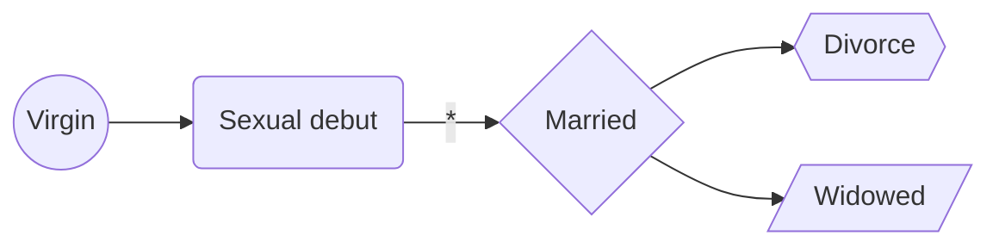
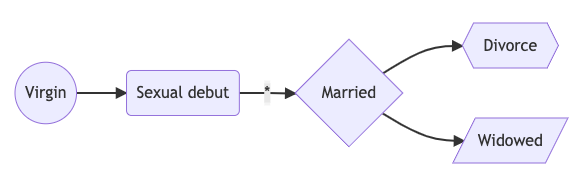
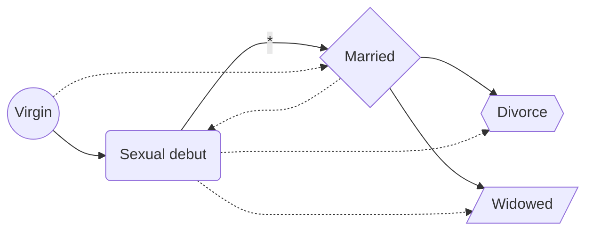
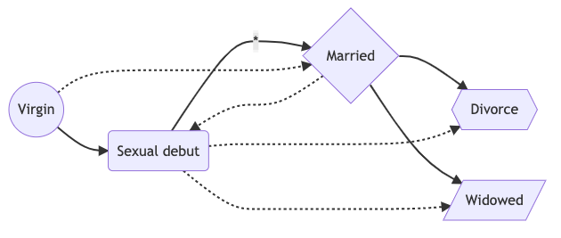
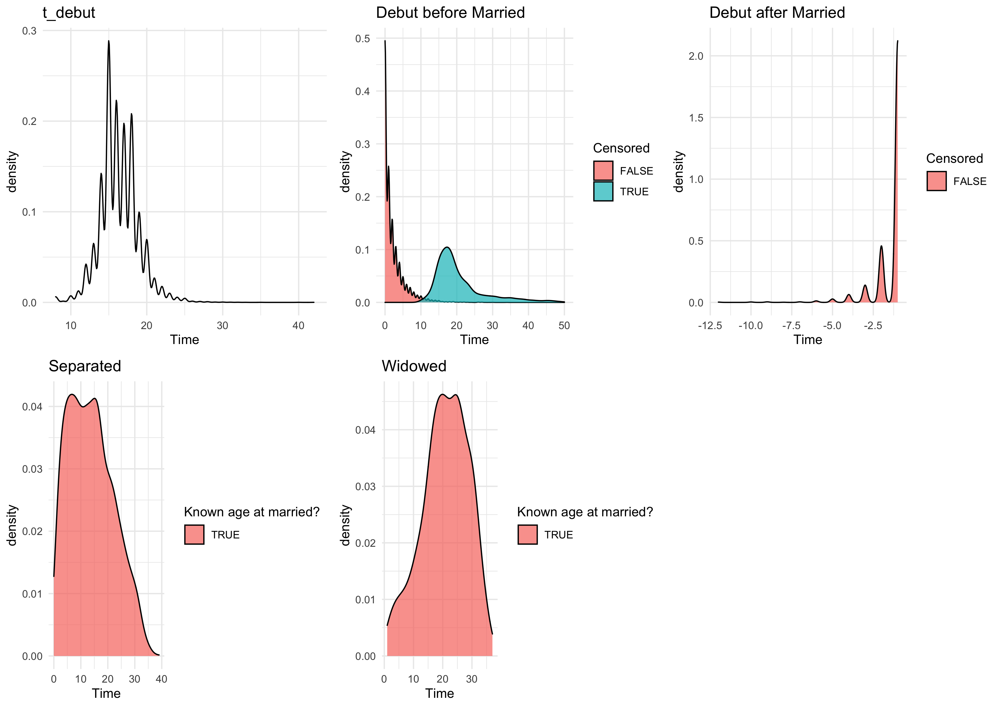

# Aims

- Estimate four hazard rates of flow below





The arrows show which transitions are possible between states in our model.

# Methods

## Data

We extract age at first sex, age at marriage, and marital statuses variable from
DHS. From this, we calculate the time since birth to first sex, from first sex
to marriage, from married to divorce or widowed.

We assumed that marriage event occurs after sexual debut; in case the events
coincide, we allowed individual to quickly pass through sexual debut and move to
married state. Remarried is not considered here as the variable was not
collected in the DHS.

### Differences in the states transition

- Virgin to sexually debuted and to married: these transitions can be assumed to
  be exactly observed at the reported AFS and age at married.
- Married to divorce or widowed: we know the age at marriage and the current
  state, but we don't know when the divorce or the death of spouse occurred.
  These transitions are thus interval censored.
- Union: we know AFS and current state but don't know the time of union. If we
  group married and union into one group. This will be treated as interval
  censor between AFS and current age while the married age is treated as exact
  observed time.
  - [ ] TODO: need to write code to cover this in the likelihood
- Separated: depending on whether age at married is know or not; if known,
  interval censor between age at married and current age, if not interval censor
  between AFS and age.
  - [ ] TODO: need to write code to cover this in the likelihood

These differences yield different likelihood contributions.

## Multistate survival model

During the time before the survey, at a time $t$ the individual is in state
$S(t)$. The next state to which the individual moves, and the time of the
change, are governed by a set of *transition intensities* $q_{rs}(t, z(t))$ for
each pair of states $r$ and $s$. The intensities may depend on the process time
$t$ or individual-specific or time-varying explanatory variables $z(t)$. The
intensity represents the instantaneous risk of moving from state $r$ to state
$s$ 

$$q_{ rs }(t, z(t)) = lim_{\delta_t\rightarrow0}\frac{P(S(t+\delta t)=s|S(t)=r)}{\delta t}$$

The intensities form a matrix $Q$ whose rows sum to zero, so that the diagonal
entries are defined by $q_{rr} =-\sum_{s\neq r}q_{rs}$.

$$Q(t) = \begin{bmatrix}
-q_{VS} & q_{VS} & 0 & 0 & 0 \\
0 & -q_{SM} & q_{SM} & 0 & 0 \\
0 & 0 & -(q_{MD} + q_{MW}) & q_{MD} & q_{MW} \\
0 & 0 & 0 & 0 & 0 \\
0 & 0 & 0 & 0 & 0 \\
\end{bmatrix}$$

where $V, S, M, D, W$ denotes virgin, sexually debuted, married, divorce, and
widowed. To fit a multistate model to data, we estimate matrix Q. 

## Markov assumption

The Markov assumption is that future evolution only depends on the current
state. That is, $q_{rs}(t,z(t),F_t)$ is independent of the observation history
$F_t$ of the process up to the time preceding $t$. In a time-homogeneous
continuous-time Markov model, a single period of occupancy in state $r$ has an
exponential distribution, with rate given by $-q_{rr}$, (or mean $-1/q_{rr}$).
The remaining elements of the $r$th row of $Q$ are proportional to the
probabilities governing the next state after $r$ to which the individual makes a
transition. The probability that the individual’s next move from state $r$ is to
state $s$ is $-q_{rs}/q_{rr}$ which altogether forms the *transition probability
matrix* $P(t)$. 

$P (t)$ can be calculated by taking the matrix exponential of the transition
intensity matrix $Q$. For a time-homogeneous process, the $(r, s)$ entry of $P (t)$,
$p_{rs}(t)$, is the probability of being in state $s$ at a time $t + u$ in the
future, given the state at time $t$ is $r$. It is difficult to calculate
reliably [@molerNineteenDubiousWays2003]. For simpler models, analytic
expression for each element of $P (t)$ in terms of $Q$ can be derived. This is
faster and avoids the potential numerical instability of calculating the matrix
exponential [@van2016multi].

## Likelihood

Let $i$ indexes $N$ individuals. The data for individual $i$ consist of a series
of times $t_{i1},..., t_{i m_i}$ and corresponding states $S(t_{i1}),...,
S(t_{im_i})$, where $m_i$ the number of recorded states which can be be varied
between individuals. Given a pair of successive states $S(t_j),S(t_{j+1})$ at
times $t_j , t_j +1$. The contribution to the likelihood from this pair of
states is 

$$L{i,j} = p_{S(t_j) S(t_{j+1})}(t_{j+1} - t_j)$$ 

which is the entry of the transition matrix $P(t)$ at the $S(t_j)$th row and
$S(t_{j+1})$th column, evaluated at $t=t_{j+1} - t_j$. The full likelihood $L(Q)$
is the product of all such terms $L_{i,j}$ over all individuals and all
transitions.

$$L(Q) = \prod_{i=1}^{i=N}\prod_{j=1}^{m_i - 1} L_{ij}$$

Depending on how the events and times are defined, $P(t)$ can take different
forms.

### Exact transition time

Assuming individual responses to DHS is accurate, events "observed" in the model
represents exact transition times in between the states, with no transitions
occurred between the observation times. For example, response of individual $i$
to the AFS at time $t_{ij}$ (age) marks the exact time of transition from virgin
to sexually debuted and that sexually debut events was not occurred in between
the time from birth and the AFS. In this case, the likelihood contribution does
not require determining the transition probability $P$ but only the intensity
matrix $Q$

$$L_{ij} = \exp[q_{S(t_j)S(t_j)}(t_{j+1} - t_j)] \times q_{S(t_j)S(t_{j+1})}$$

since the state is assumed to be $S(t_j)$ throughout the interval between $t_j$
and $t_{j+1}$ with a known transition to state $S(t_{j+1})$ at $t_{j+1}$.

## Covariates

Explanatory variables for a particular transition intensity can be modelled a
function of these variables. A proportional hazards model where the transition
intensity matrix elements $q_{rs}$ of interest can be replaced by
[@marshallMultistateModelsDiabetic1995]

$$q (z(t)) = q(0)\exp(\beta^T_{rs} z(t))$$

If the covariates $z(t)$ are time dependent, the contributions to the likelihood
of the form $p_{rs}(t - u)$ are replaced by $p_{rs}(t - u,z(u))$ which requires
that the value of the covariate is known at every observation time $u$. 

## Implementation

### Model 1 - no random effect - exponential distribution 

Using `msm` package, the likelihood is maximised with crude initial values,
which can be set supposing that transitions between states take place only at
the observation times. If we observe $n_{rs}$ transitions from state $r$ to
state $s$, and a total of $n_r$ transitions from state $r$, then $q_{rs}/q_{rr}$
can be estimated by $n_{rs}/n_r$. Then, given a total of $T_r$ years spent in
state $r$, the mean sojourn time $1/q_{rr}$ can be estimated as $T_r/n_r$. Thus,
$n_{rs}/T_r$ is a crude estimate of $q_{rs}$.

# Preliminary results

## Data

In Malawi survey 2015, 17.9% of the data has AFS older than age at married with
an average difference of 1.43. 
  - [ ] how to treat this? a separate model? remove?
- Two records with married state but no AFS (removed).

The actual flow in data is 







In this data all divorce, separate, and widowed were married.

```{r, include=FALSE}
library(tidyverse)
library(msm)
```

The number of transition events showed all those sexually debuted married, 13%
got separated, and 3.6% becamed widowed. 

```{r, echo=FALSE, results="asis"}
msdta <- readRDS("data/mw2015.rds")
statetable.msm(state = state, subject = pid, data = msdta) %>% knitr::kable()
```

## Fitting model 

Those who debuted sexually within a year of marriage age is recoded to the same
age at married, the rest is discarded for this analysis. 

- [ ] how to treat sexually debuted after married

### Transition intensity matrix template initiation

```{r, echo=FALSE}
Q <- rbind(
    c(0.0, 0.1, 0.0, 0.0, 0.0),
    c(0.0, 0.0, 0.1, 0.0, 0.0),
    c(0.0, 0.0, 0.0, 0.1, 0.1),
    c(0.0, 0.0, 0.0, 0.0, 0.0),
    c(0.0, 0.0, 0.0, 0.0, 0.0)
)

msdta <- msdta %>% filter(!pid %in% c(13889, 14566))

# get crude Q
Q.crude <- crudeinits.msm(state_numeric ~ time, pid, data = msdta, qmatrix = Q)
Q.crude
```

### Test model without unterval censored

```{r, echo = FALSE}
mod.msm <- msm(state_numeric ~ time,
    subject = pid, data = msdta, qmatrix = Q,
    exacttimes = TRUE,
    obstype = 2
)

mod.msm
```

### Transition intensity matrices

```{r, echo=FALSE}
qmatrix.msm(mod.msm)
```

### Transition probability matrices

```{r, echo=FALSE}
pmatrix.msm(mod.msm, t = 1) %>% round(3)
```

- Why getting transition from virgin to separated and widowed here while the
model estimates did not have it? 


### Test model without censored

```{r, echo = FALSE}
testthat::expect_error(
    mod.msm <- msm(state_numeric ~ time, subject = pid, data = msdta, qmatrix = Q, obstype = 1)
)
```

# Notes:

- Right censored
- Interval censored

- Rate by ages
- by period

Married multiple times
- remarried quite high >> 
- % married more than one
- do interval censor survival analysis

# References