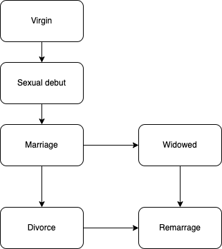

## Aims

- Model the multistages transition

 

Considering

- Covariate effects
- where I’ve been impacts where I might go?

## Methods

### Models

Markov multi-state models: current stage depends only on the present
$$P(Y(T) = b | Y(s) = a, H_s) = P(Y(T) = b | Y(s) = a)$$

The $k$th transition from state $a_k$ to stage $b_k$ is
$$h_k(t) = lim_{\delta_t\rightarrow0}\frac{P(Y(t+\delta t)=b_k|Y(t)=a_k)}{\delta t}$$
which represents instantaneous risk of moving from state $a_k$ to state $b_k$. 

This is a combination of transition-specific survival model.

### Data preps

- Stacked/long data form preparation
- 5 indicators for the stages
- 5 time intervals
  - sex free
  - marriage free
  - "widowed free"
  - "divorce free"
  - "remarriage free"
  - "overall time" which is current age

Issues:

- Age is used to define time interval but it can be a influential factor for the
  stage transition (covariate)
- age at marriage cannot be used to define time period for:
  - the partnered up but not marriage couple vs. marriage
  - the separated from partnered vs. divorced
  - > How to treat non marriage
- No remarried variable

